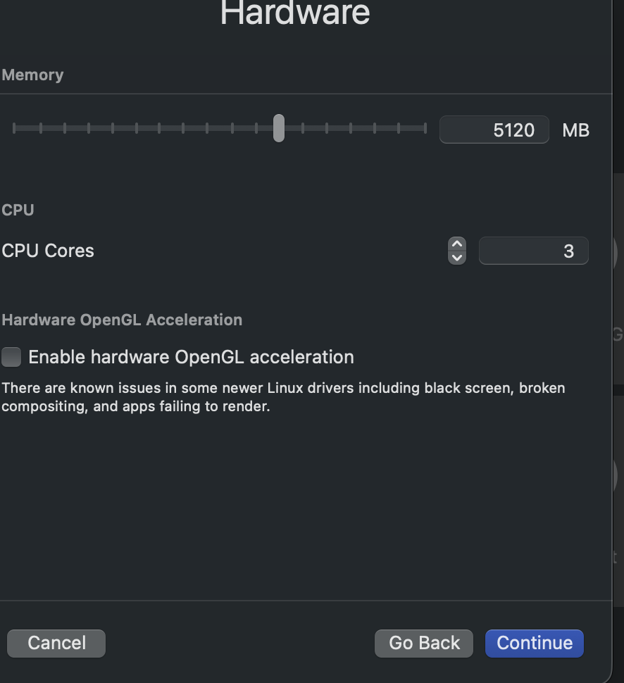
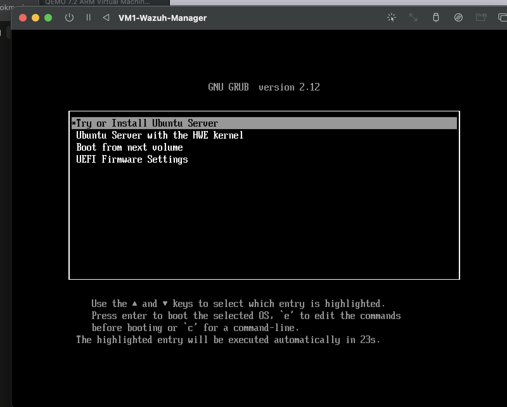
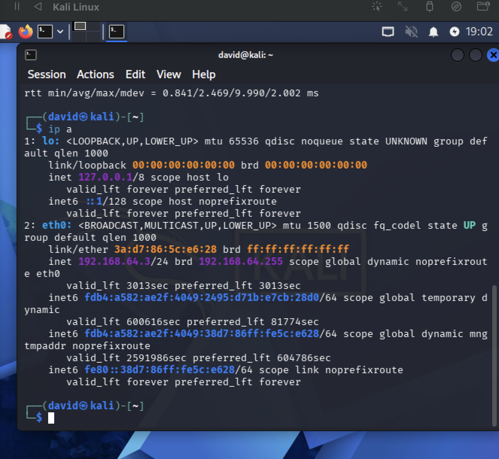
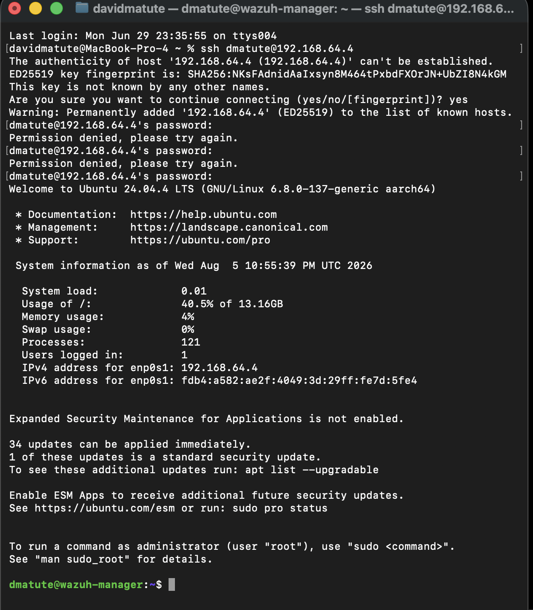
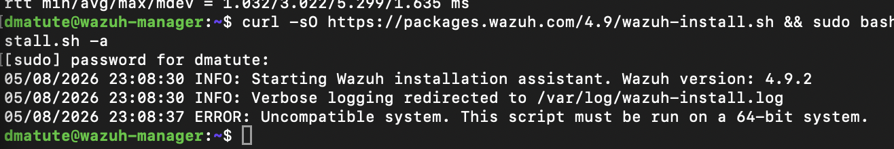
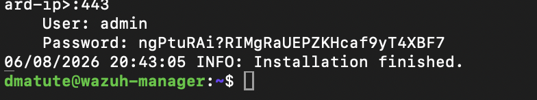
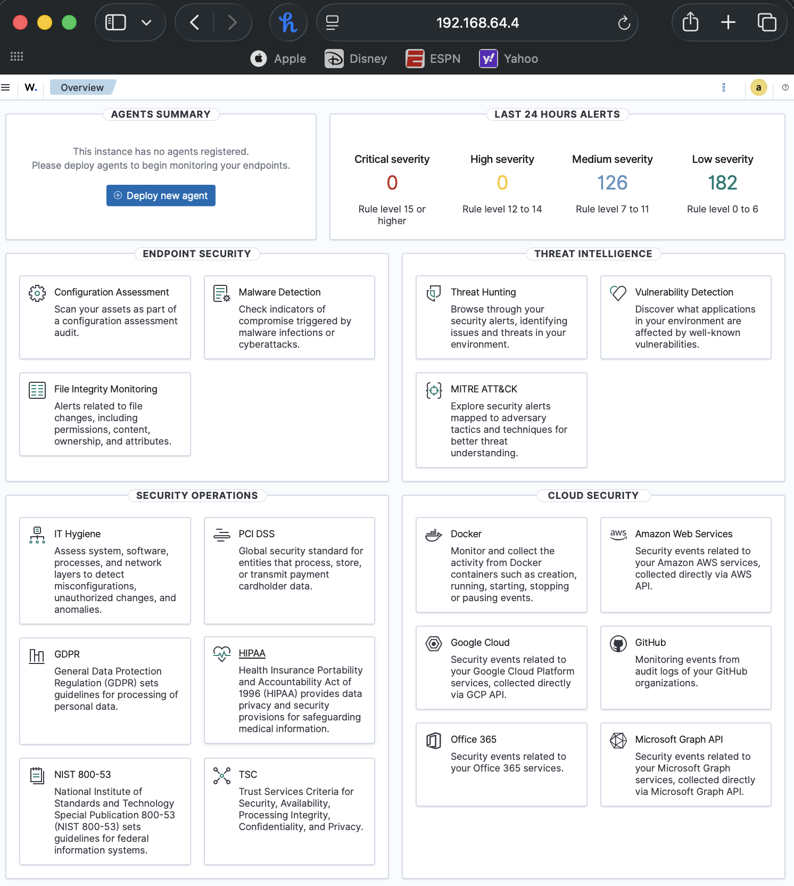

# Wazuh IR Lab: Detecting SSH Brute-Force Attacks on a Compromised Endpoint

- **Tool:** Wazuh (open-source SIEM/XDR)
- **Author:** David Matute-Jimenez
- **Course:** BCYB644-Intro-to-Inform-and-Cybersecurity

---

## 1. Tool Overview

Wazuh is a free, open-source security platform that combines SIEM (Security Information and Event Management) and XDR (Extended Detection and Response) capabilities. It collects log data from monitored endpoints, correlates that data against a rule engine, and generates real-time alerts when suspicious or malicious activity is detected.

Wazuh is built around three main components: a lightweight **agent** installed on each monitored endpoint that collects and forwards log data; a central **manager** that analyzes that data against its rule engine and decoders; and an **indexer and dashboard** that store alerts and logs and provide a web interface for investigation.

Wazuh solves several core problems in cybersecurity: it enables near real-time threat detection (such as flagging repeated failed login attempts as a possible brute-force attack), gives analysts centralized visibility across an environment instead of manually checking individual system logs, maps alerts to MITRE ATT&CK techniques for deeper context, and supports custom detection rules for threats the default ruleset doesn't cover.

In the incident response lifecycle, Wazuh is most directly tied to the **Identification** phase, since it turns raw log data into an actionable alert an analyst can investigate. This project demonstrates that role directly: Wazuh detects an SSH brute-force attack against a simulated victim endpoint, generates an alert, and supports the follow-up analysis (custom rule creation, MITRE mapping) that comes after initial detection.

---

## 2. Tool Requirements, Setup & Workflow

### VM Setup
**Author: David**

## To Run This Project (Step-By-Step Guide)

### 2.1 Download and Install UTM

**Step 1:** Visit https://mac.getutm.app/, download UTM for macOS, open the `.dmg`, and drag UTM into the Applications folder. Launch it and grant any permissions prompted.

---

### 2.2 Download Ubuntu Server 24.04.4 (ARM64)

**Step 2:** Visit https://ubuntu.com/download/server and select the **64-bit ARM (AArch64) server install image**, since UTM on Apple Silicon requires ARM64, not the standard x86 ISO. Download Ubuntu Server **24.04.4 LTS** (Noble Numbat).

---

### 2.3 Deploy Ubuntu Server as VM1 (Wazuh Manager)

**Step 3:** In UTM, click **Create a New Virtual Machine** and select the Ubuntu Server ARM64 ISO as the boot image.

**Step 4:** Allocate hardware resources. Due to the 8GB RAM constraint on the host machine, this VM was configured with 5GB RAM, 3 CPU cores, and 30GB storage.



**Step 5:** Name the VM **VM1-Wazuh-Manager** and complete creation.

---

### 2.4 Install Ubuntu Server on VM1

**Step 6:** Boot the VM and select **Ubuntu Server** (not the minimized variant) as the installation type. Configure networking (DHCP auto-assigned IP `192.168.64.4`), guided storage using the entire disk, and the user profile (username: `dmatute`).

**Step 7:** In SSH configuration, check **Install OpenSSH server** and leave **Allow password authentication over SSH** enabled, since this is required later for the Hydra brute-force demo.


**Step 8:** Complete installation, remove the installation medium, and reboot.

> **Troubleshooting note:** The VM hit a GRUB reboot loop on first restart because the ISO wasn't ejected. Fixed by force-stopping the VM in UTM and manually clearing the CD/DVD drive in VM Settings before rebooting.



**Step 9:** VM1 boots successfully into the installed system.

---

### 2.5 Deploy Kali Linux on UTM

Kali Linux was deployed as the attacker VM following Kali's official documentation. Since Kali provides a well-maintained, standard installation process (unlike the ARM64-specific issues encountered with Ubuntu Server), this section is intentionally brief; the official guides cover the process more thoroughly than a re-documentation here would.

**Step 10:** Follow Kali Linux's official UTM installation guide: https://www.kali.org/docs/virtualization/install-utm-guest-vm/

This guide will walk you through downloading the Kali Linux ARM64 image for UTM, creating a new virtual machine, allocating CPU/RAM/storage resources, and importing the Kali Linux image.

### 2.6 Setup and Configure Kali Linux

**Step 11:** Follow Kali Linux's installation and setup guide: https://www.kali.org/docs/installation/hard-disk-install/

This guide will walk you through initial boot and configuration, partitioning and disk setup, user account creation, system updates, and desktop environment setup.

### 2.7 Login to Kali Linux

**Step 12:** At the Kali Linux login screen, log in with username `kali` / password `kali`.

**Step 13:** Confirm the VM is networked correctly by checking its assigned IP address (`192.168.64.3`).



---

### 2.8 Confirm Network Connectivity Between VMs

**Step 14:** With both VMs running in UTM's Shared Network mode, ping VM1 from Kali to confirm connectivity.


**Step 15:** Confirm SSH access from the host Mac terminal into VM1.



---

### 2.9 Wazuh Installation on VM1

**Step 16:** With VM1 up and networked, the default Wazuh install script was downloaded and run:

```bash
curl -sO https://packages.wazuh.com/4.9/wazuh-install.sh && sudo bash wazuh-install.sh -a
```

The script immediately rejected the system, even though VM1 is genuinely 64-bit, just ARM64, not x86_64:

```
ERROR: Uncompatible system. This script must be run on a 64-bit system.
```



**Fix:** Wazuh's 4.14 branch includes proper ARM64 support. Switching to the version-specific installer resolved the issue and the install proceeded normally:

```bash
curl -sO https://packages.wazuh.com/4.14/wazuh-install.sh
sudo bash ./wazuh-install.sh -a
```


**Step 17:** Partway through, the installer failed at the **Wazuh dashboard** stage and automatically rolled back the entire installation. Investigating the install log revealed the real cause was a **disk-full error**: `df -h /` showed the root partition at only 14G total with 58% used, far less than the 30GB the VM was allocated. Ubuntu's guided LVM partitioning had under-allocated the volume group, leaving space unclaimed.


**Fix:** Extended the logical volume to claim the unallocated space:

```bash
sudo lvextend -l +100%FREE /dev/ubuntu-vg/ubuntu-lv
sudo resize2fs /dev/ubuntu-vg/ubuntu-lv
```

**Step 18:** Re-ran the installer. This time it completed cleanly through every stage, including the dashboard, and printed the final credentials:

```
User: admin
Password: ngPtuRAi?RIMgRaUEPZKHcaf9yT4XBF7
```



**Step 19:** Logging into the dashboard initially returned a `TimeoutException` retrieving internal user configuration from the indexer, an HTTP 500 error.


Diagnosis traced this back to the disk filling up a second time. The indexer's own index and log growth had consumed the remaining space, and the earlier `lvextend` fix had only reclaimed space *within* the existing 30GB virtual disk, leaving nothing left to extend into.

**Fix:** Resized the actual UTM virtual disk (30GB to 40GB) in VM Settings, then claimed the new space inside the guest OS with `growpart`, `pvresize`, `lvextend`, and `resize2fs`, and restarted all three Wazuh services in order (indexer, then manager, then dashboard).

**Step 20:** With the disk properly sized, the dashboard loaded successfully with no further errors.



This closed out the Wazuh installation. VM1 was now running a stable indexer, manager, and dashboard stack with adequate disk headroom, setting up the self-monitoring configuration described in Section 2.10.

---

### 2.10 Architecture Note: VM1's Dual Role

**Note:** Due to hardware constraints, VM1 serves as both the Wazuh manager and the monitored "victim" endpoint. This is possible because every Wazuh manager includes a built-in local agent (reserved ID `000`) that self-monitors the host it runs on; no separate agent installation is required. In a production deployment, the manager and monitored endpoints would typically run on separate systems, with agents deployed independently to each monitored host.

VM1 (`192.168.64.4`) therefore acts as both the infrastructure running Wazuh (manager, indexer, dashboard) *and* the simulated victim endpoint, the "compromised employee laptop" targeted by the SSH brute-force attack demonstrated in Section 4. See Section 3 for the `agent_control -l` output confirming agent 000's active status.

---

### 2.11 Workflow Diagram

*(TBD, diagram illustrating how Wazuh operates: Agent to Manager (rule engine/decoders) to Indexer to Dashboard, with the attack scenario overlaid: Kali (attacker) to SSH brute-force to VM1 (agent 000 self-monitoring) to Wazuh Manager analysis to Alert generated to Dashboard/Analyst review.)*

---

## 3. Core Features

### 3.1 Architecture: Agents, Manager, Indexer, and Dashboard

Wazuh is built around four architectural components that work together to move raw data into actionable intelligence.

**Agents** are lightweight programs installed on monitored endpoints (servers, workstations, cloud instances) that collect log data, monitor file integrity, and report system state back to a central manager. Agents run with minimal system overhead and are each identified by a unique agent ID. Every Wazuh manager also includes a built-in local agent (reserved ID `000`) that self-monitors the host it runs on, without requiring separate installation.

The **manager** is the analysis engine, and functions in two stages. A **decoder** first parses raw, unstructured log text into structured fields, for example, taking a single line of SSH log output and extracting the source IP, destination username, and port as separate, queryable fields. This matters because raw text alone can't be reliably filtered, aggregated, or correlated; structuring it is what makes detection possible in the first place. Once decoded, the **rule engine** evaluates those structured fields against Wazuh's ruleset: thousands of XML-defined rules, each carrying a severity level (0 to 15, with higher numbers indicating greater urgency), that determine whether and how loudly an event should generate an alert. Rules can match single events outright, or correlate patterns across multiple events over a defined time window, for instance, treating one failed login as routine but a sudden burst of them from the same source as evidence of an attack. This correlation capability is what separates a SIEM's rule engine from simple log storage: it lets the same underlying event data support both "did this happen" and "does this look like an attack pattern" simultaneously.

The **indexer**, built on OpenSearch, stores and indexes every alert the manager generates, making the full history of alerts and logs searchable at scale. This is the component that makes months of accumulated security data usable rather than just archived.

The **dashboard** is a web-based interface that queries the indexer and displays results. It does not generate or store any data itself; it is purely a visualization and investigation layer for analysts, organized into a home page (shown below) and several purpose-built modules covering each of Wazuh's feature areas.


### 3.2 Endpoint Security

This category covers detection and hardening at the individual host level, focused on the state of a system rather than network traffic passing through it. **Configuration Assessment** scans a system's settings against known security baselines (such as CIS benchmarks) to flag misconfigurations that could weaken its security posture even in the absence of an active attack. **Malware Detection** checks for indicators of compromise associated with known malware signatures or cyberattack patterns, correlating local system state against threat intelligence feeds. **File Integrity Monitoring (FIM)** tracks changes to files and directories, including permissions, ownership, content, and timestamps, and alerts when unauthorized or unexpected modifications occur. FIM is particularly valuable for detecting persistence mechanisms or tampering that happens *after* an initial compromise, since an attacker who has already gained access will often modify configuration files, add backdoors, or alter system binaries as a next step.

### 3.3 Threat Intelligence

This category focuses on understanding attacker behavior across collected data, rather than flagging individual events in isolation. **Threat Hunting** provides a searchable, aggregated view of security alerts, letting an analyst browse alert volume, top triggered rules, and affected hosts over a given time window, rather than reviewing raw logs line by line. This shifts investigation from reactive ("what does this one alert mean") to proactive ("what patterns exist across all my alerts right now"). **Vulnerability Detection** cross-references installed software versions against known vulnerability databases (such as CVE feeds) to flag applications with unpatched, publicly known weaknesses, useful for identifying exposure *before* it's exploited, rather than only detecting exploitation after the fact. The **MITRE ATT&CK** module maps detected alerts directly to specific adversary tactics and techniques from the MITRE ATT&CK framework, a widely used industry-standard taxonomy of attacker behavior maintained by MITRE Corporation. This mapping happens automatically for rules that correlate to known techniques, meaning an alert isn't just "something bad happened" but is tied to a specific, named point in an attacker's likely playbook (for example, "Brute Force" under the "Credential Access" tactic), giving analysts a standardized reference point instead of relying solely on their own interpretation of severity or intent.

### 3.4 Security Operations

This category centers on compliance and organizational hygiene rather than direct threat detection. **IT Hygiene** assesses systems, software, and network configuration at scale for misconfigurations and anomalies, functioning as a broader housekeeping check across an environment. The remaining tools, **PCI DSS**, **GDPR**, **HIPAA**, **NIST 800-53**, and **TSC**, each automatically map triggered alerts to the specific controls or clauses of their respective regulatory or industry framework. This is a meaningful time-saver in real organizational use: rather than an analyst or compliance officer manually cross-referencing every alert against, say, PCI DSS requirement 10.2.4, Wazuh attaches that mapping to the alert itself at the moment it's generated, as part of the rule's own metadata.

### 3.5 Cloud Security

This category extends Wazuh's monitoring beyond on-premises endpoints into cloud and SaaS environments, reflecting the reality that most modern organizations run infrastructure and services outside a traditional network perimeter. Dedicated integrations exist for **Docker** (monitoring container lifecycle events such as creation, starting, and stopping), **Amazon Web Services** and **Google Cloud Platform** (security events pulled directly via each provider's respective API), **GitHub** (audit log monitoring for organizational activity), and **Office 365** / **Microsoft Graph API** (Microsoft 365 service security events). These integrations funnel cloud-native security events through the same manager/indexer/dashboard pipeline used for on-premises endpoints, meaning an organization doesn't need a separate tool or dashboard to correlate on-prem and cloud activity together.

### 3.6 `wazuh-logtest`: Offline Rule Validation

Wazuh includes a command-line utility, `wazuh-logtest`, that allows an analyst to test how a given log line would be decoded and which rules it would match, entirely offline, without needing to generate a live event or query the indexer/dashboard. Each submitted log line runs through the full decode-then-match pipeline, and the tool reports exactly which rule ID and severity level fired, along with any associated MITRE ATT&CK mapping and firing count if the rule is frequency-based. This makes it a genuinely practical tool in two distinct scenarios: troubleshooting why an *existing* rule isn't firing as expected on production data, and validating a *newly written* custom rule's logic before deploying it against live traffic, where a mistake could mean either missed detections or a flood of false positives.

```bash
sudo /var/ossec/bin/wazuh-logtest
```

---

## 4. Practical Application

*(TBD, incident narrative: disgruntled employee laptop compromised via weak SSH creds. Hydra brute-force attack steps and output. Wazuh alerts firing, rule IDs. Custom rule and wazuh-logtest validation. MITRE ATT&CK T1110 mapping.)*

---

## 5. Strengths & Limitations

*(TBD, Strengths: real-time detection, customizable rules, MITRE integration. Limitations/scope tradeoffs: no active-response demo, no FIM demo, RAM constraint rationale, including VM1's dual manager/endpoint role (see Section 2.10). Lessons learned: ARM64 install issue, disk sizing x2, GRUB reboot loop.)*

---

## 6. References

*(TBD, Wazuh docs, MITRE ATT&CK, UTM/Ubuntu/Kali install guides used)*
