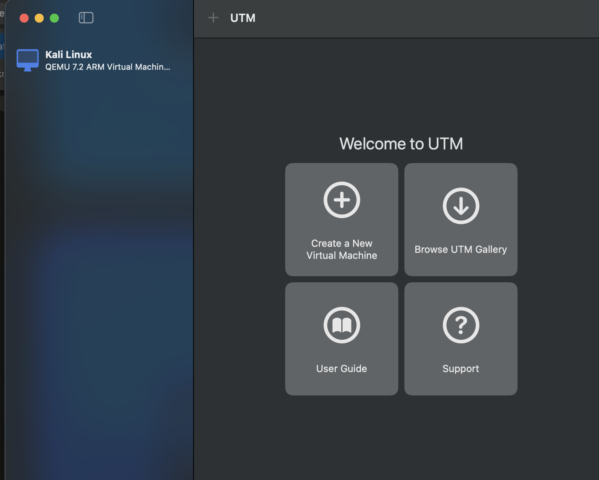
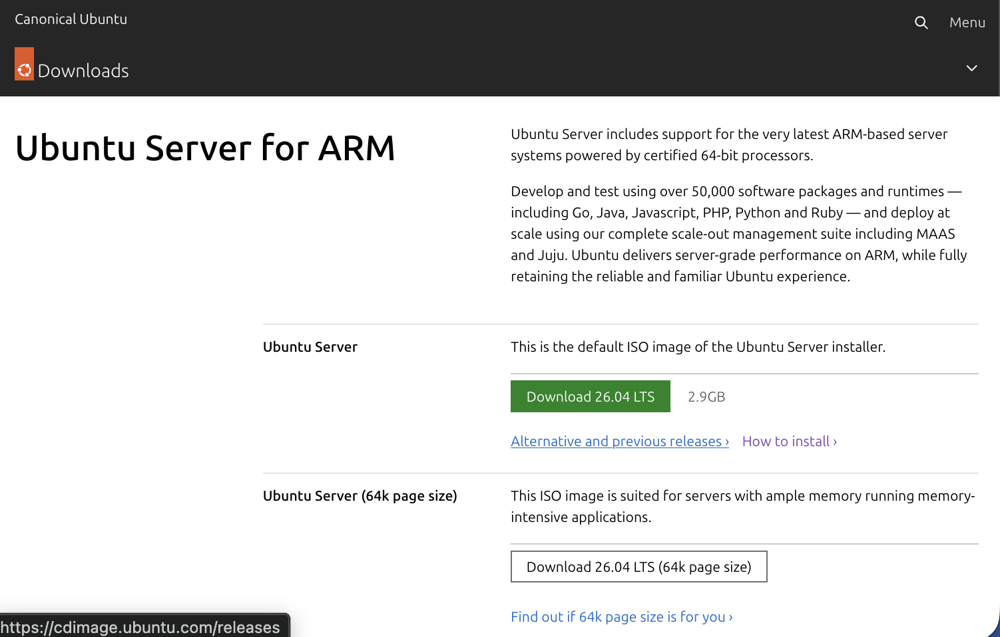
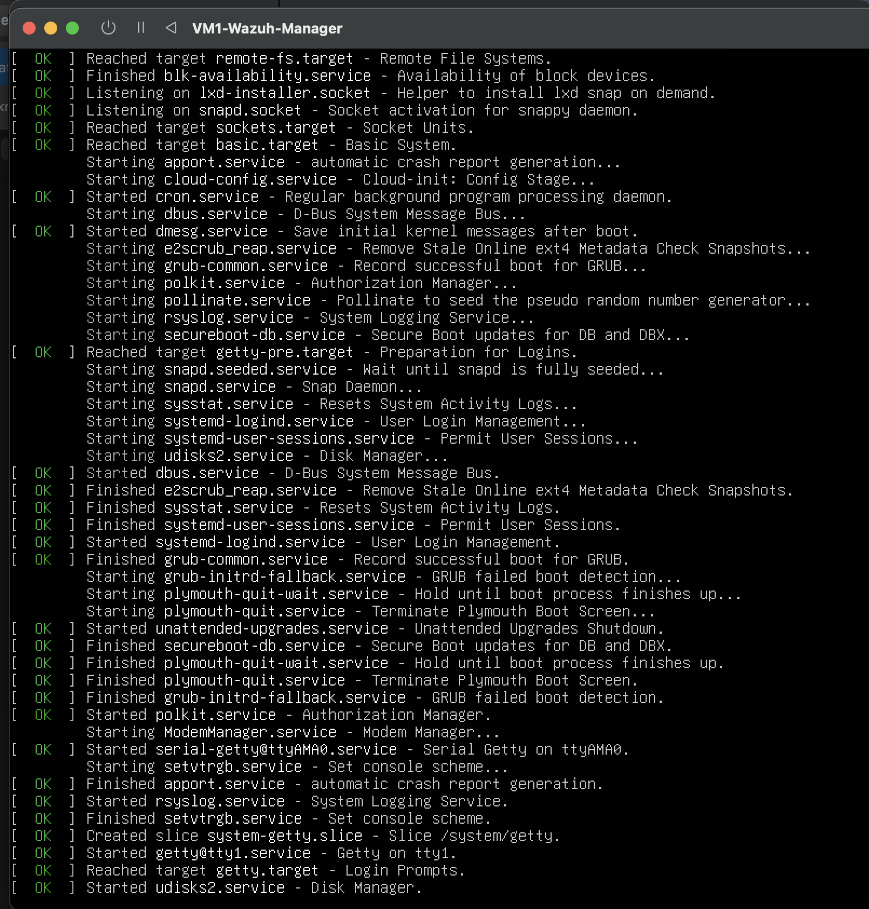
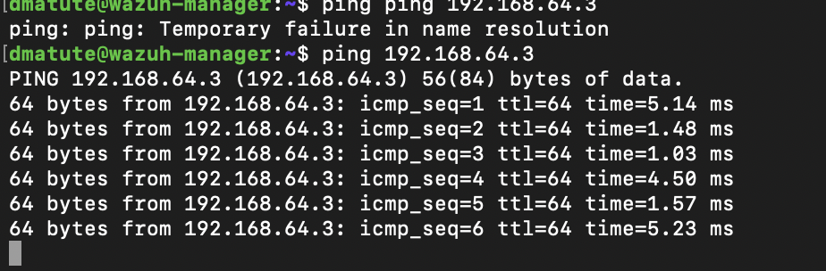

# Wazuh IR Lab: Detecting SSH Brute-Force Attacks on a Compromised Endpoint

## 1. Title
- **Tool:** Wazuh (open-source SIEM/XDR)
- **Author:** David Matute-Jimenez
- **Course:** [course name]

---

## 2. Tool Overview

*(TBD — brief summary of Wazuh: what it is, what problem it solves, why it's relevant to incident response)*

---

## 3. Tool Requirements, Setup & Workflow

### VM Setup
**Author: David**

## To Run This Project (Step-By-Step Guide)

### 3.1 Download and Install UTM

**Step 1:** Visit https://mac.getutm.app/

**Step 2:** Click the download button for macOS

**Step 3:** Open the downloaded `.dmg` file

**Step 4:** Drag UTM to your Applications folder

**Step 5:** Open Applications folder and launch UTM

**Step 6:** Grant any necessary permissions when prompted

---

### 3.2 Download Ubuntu Server 24.04.4 (ARM64)

**Step 7:** Visit https://ubuntu.com/download/server and select the **64-bit ARM (AArch64) server install image** — UTM on Apple Silicon requires ARM64, not the standard x86 ISO.

**Step 8:** Download Ubuntu Server **24.04.4 LTS** (Noble Numbat).

---

### 3.3 Deploy Ubuntu Server as VM1 (Wazuh Manager)

**Step 9:** In UTM, click **Create a New Virtual Machine** and select the Ubuntu Server ARM64 ISO as the boot image.

**Step 10:** Allocate hardware resources. Due to the 8GB RAM constraint on the host machine, this VM was configured with 5GB RAM, 3 CPU cores, and 30GB storage.

**Step 11:** Name the VM **VM1-Wazuh-Manager** and complete creation.

---

### 3.4 Install Ubuntu Server on VM1

**Step 12:** Boot the VM and select **Ubuntu Server** (not the minimized variant) as the installation type.

**Step 13:** Configure networking — DHCP auto-assigned IP `192.168.64.4`.

**Step 14:** Configure guided storage using the entire disk.

**Step 15:** Set up the user profile (username: `dmatute`).

**Step 16:** In SSH configuration, check **Install OpenSSH server** and leave **Allow password authentication over SSH** enabled — this is required later for the Hydra brute-force demo.

**Step 17:** Complete installation, remove the installation medium, and reboot.

> **Troubleshooting note:** The VM hit a GRUB reboot loop on first restart because the ISO wasn't ejected. Fixed by force-stopping the VM in UTM and manually clearing the CD/DVD drive in VM Settings before rebooting.

**Step 18:** VM1 boots successfully into the installed system.

---

### 3.5 Deploy Kali Linux on UTM

**Step 19:** Follow Kali Linux's official UTM installation guide: https://www.kali.org/docs/virtualization/install-utm-guest-vm/

This guide will walk you through:
* Downloading the Kali Linux ARM64 image for UTM
* Creating a new virtual machine in UTM
* Allocating CPU, RAM, and storage resources
* Importing the Kali Linux image

### 3.6 Setup and Configure Kali Linux

**Step 20:** Follow Kali Linux's installation and setup guide: https://www.kali.org/docs/installation/hard-disk-install/

This guide will walk you through:
* Initial Kali Linux boot and configuration
* Partitioning and disk setup
* User account creation
* System updates and package configuration
* Desktop environment setup

### 3.7 Login to Kali Linux

**Step 21:** At the Kali Linux login screen, enter:
* **Username:** `kali`
* **Password:** `kali`

**Step 22:** Press Enter to login

---

### 3.8 Confirm Network Connectivity Between VMs

**Step 23:** With both VMs running in UTM's Shared Network mode, ping VM1 from Kali to confirm connectivity.

**Step 24:** Ping Kali from VM1 to confirm bidirectional connectivity.

**Step 25:** Confirm SSH access from the host Mac terminal into VM1.

---

### 3.9 Wazuh Installation on VM1

*(TBD — ARM64 install script issue, disk sizing/LVM resize saga, service restart ordering fix, agent deployment)*

---

## 4. Core Features

*(TBD — Wazuh dashboard, agent-based monitoring, rule engine/decoders, wazuh-logtest, MITRE ATT&CK integration. Screenshot each as demoed.)*

---

## 5. Practical Application

*(TBD — incident narrative: disgruntled employee laptop compromised via weak SSH creds. Hydra brute-force attack steps + output. Wazuh alerts firing, rule IDs. Custom rule + wazuh-logtest validation. MITRE ATT&CK T1110 mapping.)*

---

## 6. Strengths & Limitations

*(TBD — Strengths: real-time detection, customizable rules, MITRE integration. Limitations/scope tradeoffs: no active-response demo, no FIM demo, RAM constraint rationale. Lessons learned: ARM64 install issue, disk sizing, service restart ordering, GRUB reboot loop.)*

---

## 7. References

*(TBD — Wazuh docs, MITRE ATT&CK, UTM/Ubuntu/Kali install guides used)*
